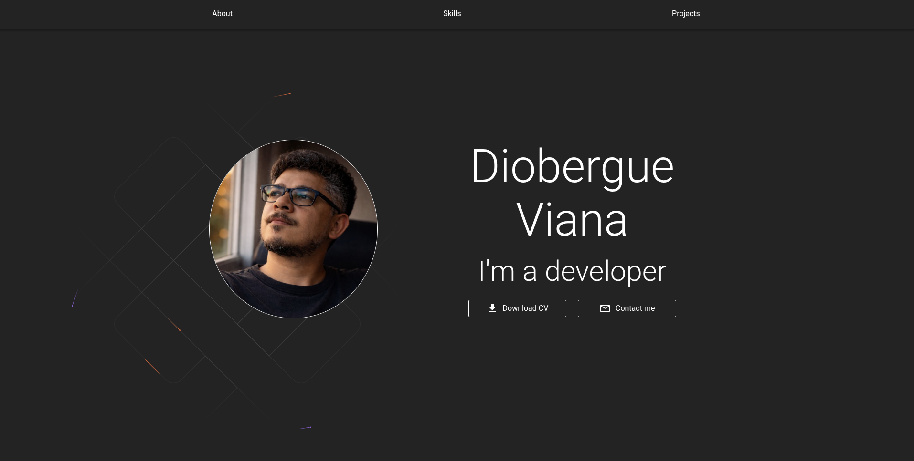

# Meus Projetos

| Projeto | Descrição | Imagem | Link |
| :---: | :--- | :---: | :---: |
| [Portfólio](https://github.com/Diobegue/Projetos-Reacts/tree/main/react_sass) | Aplicação web desenvolvida em React para gestão de tarefas. |  | [Repositório](https://github.com/Diobegue/Projetos-Reacts/tree/main/my-portfolio) |
| [ProtFólio 2](https://github.com/Diobegue/Projetos-Reacts/tree/main/my-portfolio) | Aplicação web desenvolvida em React. |  | [Repositório](https://github.com/Diobegue/Projetos-Reacts/tree/main/my-portfolio) |
| [Nome do Projeto 3](https://github.com/seu-usuario/projeto3) | Dashboard de analytics com integração a APIs externas. |  | [Repositório](https://github.com/seu-usuario/projeto3) |   
